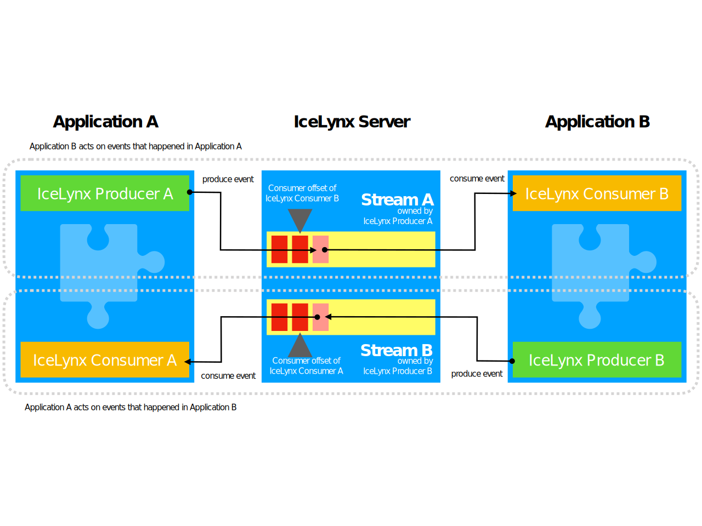
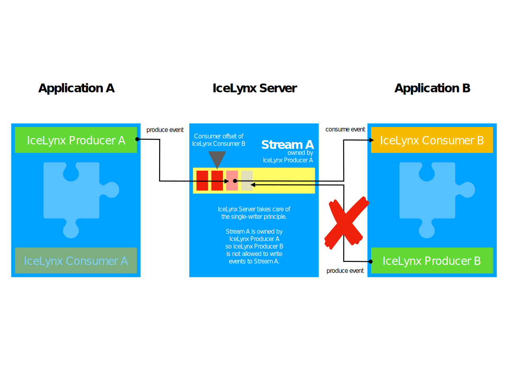

# Event server

## General purpose

Event server's purpose is to asynchronously exchange information between systems using JSON events.

The event server is an event store application with an API and web interface.

Events are stored in streams.

The events server is responsible for keeping track of the stream-single-writer constraint and the consumers' offset 
in a particular event stream.

## General event flow

[](svg/general-eventflow.svg)

## Basic event structure

```json
{
	"event": {
	    "id": "<Event ID>", /* only available when consuming an event */
		"name" : "<Event name>",
		"version" : 1
	},
	"system" : {
		"id" : "<System ID>",
		"name" :"<Plaintext system name>",
		"time": "<Date & time on the source system>",
		"timezone" : "<Timezone of the source system>"		
	},	
	"trigger" : {
		"type": "<automatic|manual>",
		"name": "</path/to/script.php|username>"
	},
	"payload" : {
	    "some-key": "some-value"
	}
} 
```

## Definitions

### What is a producer ID?

The producer ID is a globally unique identifier for each server producer instance/configuration.

The producer ID has the UUIDv4 format, e.g. `2480b859-e08a-4414-9c7d-003bc1a4c238`.

### What is a consumer ID?

The consumer ID is a globally unique identifier for each server consumer instance/configuration.

The consumer ID has the UUIDv4 format, e.g. `2480b859-e08a-4414-9c7d-003bc1a4c238`.

### What is a system ID?

The system ID is a globally unique identifier for each event producing system.
Please note that each system can be home to multiple producers or consumers.

The system ID has the UUIDv4 format, e.g. `2480b859-e08a-4414-9c7d-003bc1a4c238`.

### What is a system name?

The system name is a plaintext description of an event producing system, is related to its system ID and 
should therefor be globally unique as well.

The system name has no defined format other than a non-empty string.
The system name should be a commonly used name like "codello alvine" or "icebee mds".

### What is an event name?

The event name should describe a fact that happened in the system that is producing the event.
Therefor an event name should always be __carefully worded in past tense__ and as exact as possible.

The event name has no defined format other than a non-empty string.
The event name should describe the happened fact in the most commonly used business language in plaintext. 

Event name examples: 
* `Webshop order was placed`
* `Order fulfillment file received`
* `Google product feed written`

**Hint:** Try to avoid the usage of the CRUD words `insert`, `create`, `replace`, `update`, `delete`, etc. 
to find a name that is more descriptive regarding the language used in the company/business. Avoid technical details.

### What is an event version?

The event version is a simple (unsigned integer) number to handle future changes of the structure of events.
When producing new events you should use `1` as event version and increment this value on each change of the event.

### What is a trigger type?

The trigger type should express **how** an event was triggered.

The following values should be used:

* `manual` for events triggered by an user interaction e.g. pressing a button in the web interface.
* `automatic` for events triggered by an automatically running system component e.g. a cron job.

### What is a trigger name?

The trigger name should express **who/what** triggered an event.

* In case of an user interaction the trigger name should be the corresponding `username` in combination with trigger type `manual`.
* In case of a system component the trigger name should be the `full script/class path` of that component in combination with trigger type `automatic`.

### What is a payload?

The payload is the actual data/information object carried by the event.
In any case the payload must be a JSON object. Simple numeric indexed arrays are not allowed.

When designing your event's payload please remember that you already have a lot of meta information in the basic
event structure for the source system and who/what triggered the event. So please do not repeat this information in the payload.

The payload should hold the information that is relevant to the business.

Payload example for a simple newsletter subscription:
```json
{
    "subscriptionId": "<SubscriptionID>",
    "email": "max.mastermind@example.com",
    "gender": "male",
    "firstname": "Max",
    "lastname": "Mastermind"
}
```

### How to deal with files as payload?

If you need to inform another system about a file that should be processed. Please do not include the file's content as
payload. Create a permanent link to the file instead and put that link into the payload.

Payload example when using a file reference:
```json
{
    "fileType": "ORDER-FULFILLMENT",
    "mimeType": "application/xml",
    "filesize": 123456789,
    "url": "https://storage.my-system.de/files/<fileID>"
}
```

Please add some meta information of the file to the payload, so that the consuming application can act accordingly e.g. 
on files with big filesize.

The file storage and thus the creation of a permanent URL should be managed by the event producing system.    

### What is an event stream?

The event stream is an ordered, append-only queue of events.

The event stream should be used to group various events in logical units e.g. by defining one event stream for all 
newsletter subscription related events from a particular webshop. 

The event stream is identified by a plaintext name - the stream name.

An event stream is automatically created as soon as a producer sends an event to a non-existing stream name.
Once the stream was created it is exclusivly related to the producer ID that created it.

Example event stream for newsletter subscriptions:

**StreamName: __Codello Newsletter Subscriptions__**

| EventName                | Sequence | EventId   | Event    |
|--------------------------|----------|-----------|----------|
| Subscription initiated   | 1        | `<UUID>`  | `<JSON>` |
| Subscription initiated   | 2        | `<UUID>`  | `<JSON>` |
| Subscription confirmed   | 1        | `<UUID>`  | `<JSON>` |
| Subscription aborted     | 1        | `<UUID>`  | `<JSON>` |
| Subscription initiated   | 3        | `<UUID>`  | `<JSON>` |
| Subscription confirmed   | 2        | `<UUID>`  | `<JSON>` |
| Subscription canceled    | 1        | `<UUID>`  | `<JSON>` |
| Subscription reactivated | 1        | `<UUID>`  | `<JSON>` |

As you can see each event name gets an incrementing sequence to keep track of the order of those events. 

### What is the single-writer-constraint?

[](svg/single-writer-constraint.svg)

As already mentioned under ["What is an event stream?"](#what-is-an-event-stream?)
> Once the stream was created it is exclusivly related to the producer ID that created it.

That means that the events server makes sure that no other producer can append events to a particular event stream 
other than the one which created the stream. 

This constraint simplifies the usage of an event stream because we know it has only one input source.
The producer is the single-writer to the event stream.

So there is a n:1 relation between event stream and producer.
But a producer can create as many streams as needed, so from this perspective we have a 1:n relation.

### What is the consumer offset?

The consumer offset is a pointer kept by the events server to memorize the last sequence number of events which were 
already processed & acknowledged by a particular consumer. 

This pointer consists of the following information:

* Consumer ID
* Stream name
* Event name
* Sequence (for event name in stream name) 

A consumer will only get events which it has not acknowledged yet.
Each consumer has its own processing speed, thats why the offset is memorized for each consumer.

Example for the function of the consumer offset:

| EventName                | Sequence | EventId   | Event    |
|--------------------------|----------|-----------|----------|
| Subscription initiated   | 1        | `<UUID>`  | `<JSON>` |
| Subscription initiated   | 2        | `<UUID>`  | `<JSON>` |
| Subscription confirmed   | 1        | `<UUID>`  | `<JSON>` |
| Subscription aborted     | 1        | `<UUID>`  | `<JSON>` |
| Subscription initiated   | 3        | `<UUID>`  | `<JSON>` |
| Subscription confirmed   | 2        | `<UUID>`  | `<JSON>` |
| Subscription canceled    | 1        | `<UUID>`  | `<JSON>` |
| Subscription reactivated | 1        | `<UUID>`  | `<JSON>` |

1. The consumer requests 2 `Subscription initiated` events from the `Codello Newsletter Subscriptions` stream.
2. Consumer offset is: `0`
3. Consumer gets the events with sequence `1` and `2` from the table above.
4. Consumer processed and acknowledged both events.
5. Again, the consumer requests 2 `Subscription initiated` events from the `Codello Newsletter Subscriptions` stream.
6. Consumer offset is: `2`
7. Consumer gets the event with sequence `3`
8. Consumer processed and acknowledged this event.
9. Again, the consumer requests 2 `Subscription initiated` events from the `Codello Newsletter Subscriptions` stream.
10. Consumer offset is: `3`
11. Consumer won't get any events.
